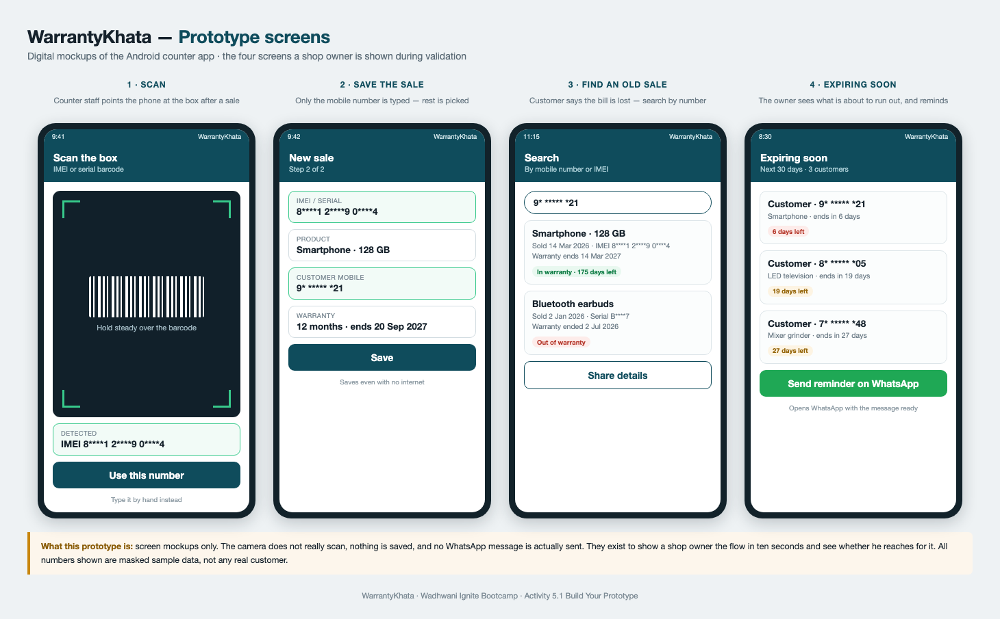
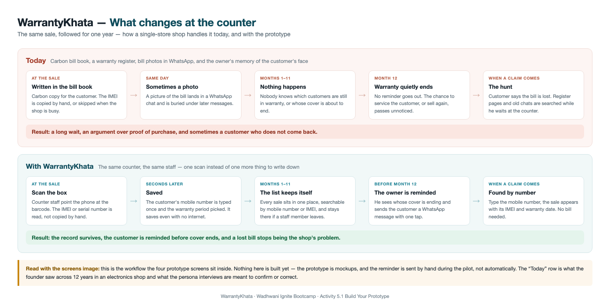

# WarrantyKhata

Warranty, serial/IMEI and follow-up record-keeping for small mobile and electronics shops. This repository holds the venture work for WarrantyKhata, prepared during the Ignite Bootcamp run by the Wadhwani Foundation and the National Entrepreneurship Network (NEN).

**Status: idea and validation stage.** No product has been built. The prototype is a set of screen mockups, the landing page has not been deployed, and the interview log is an empty template: no shop-owner interviews are recorded in it yet.

## The idea

Small mobile and electronics retailers still manage warranty records, serial/IMEI numbers and after-sales follow-ups on paper registers, Excel sheets and WhatsApp chats. WarrantyKhata is exploring a simple mobile-first tool that keeps every sale's warranty and service details in one place and reminds shop owners and customers at the right time.

The founder has 12 years of first-hand experience in electronics retail and accounts in Pune, which is where the problem comes from and where the first conversations are planned.

## The problem

What happens at the counter today, long after the sale is made:

1. **Warranty proof goes missing.** The customer lost the bill, the register page is torn, and a valid claim turns into an argument.
2. **Serial and IMEI numbers are hard to find.** Locating one old sale means flipping through months of entries or scrolling an endless chat.
3. **Customers are never followed up.** Warranties expire, services fall due, and nobody reminds the customer.

## Target user

Owners of small, single-store mobile and electronics shops, starting in Pune (Wakad, Hinjewadi and Pimple Saudagar are the areas named in the validation plan). The working persona is Rajesh Kale, a shop owner in Pune.

## What is in this repository

| File | What it is |
|---|---|
| [ignite-venture.md](ignite-venture.md) | The venture profile: company details as entered on the Ignite platform, why this problem, the other venture options considered, and an evidence ledger |
| [venture-journey-map.md](venture-journey-map.md) | The full map of Ignite Bootcamp modules and activities |
| [competitor-research.md](competitor-research.md) | Activity 4.1: direct and indirect competitors, with what each public page does and does not say |
| [macro-trends-research.md](macro-trends-research.md) | Activity 4.2: favorable and unfavorable market and regulatory trends |
| [opportunity-size-research.md](opportunity-size-research.md) | Activity 4.3: how the market-size estimate was built and which figures were rejected |
| [year1-financials.md](year1-financials.md) | Activity 4.4: back-of-the-envelope Year 1 numbers and the 3-year view |
| [module7-datapack.md](module7-datapack.md) | Module 7: launch-year monthly table and unit-economics ratios |
| [validation/validation-plan.md](validation/validation-plan.md) | How the idea will be tested with real shop owners before anything is built, with pass/fail thresholds set in advance |
| [validation/interview-script.md](validation/interview-script.md) | The shop-owner interview script (written in Roman Hinglish, the language the conversations are meant to be held in) |
| [validation/interview-log.csv](validation/interview-log.csv) | The interview log template (header row only) |
| [site/index.html](site/index.html) | Source of the single-file landing page. It is not deployed, and the contact address in this public copy is a placeholder |
| [images/](images/) | Charts, tables and mockups used in the Ignite submissions (see below) |

## Images

| Image | Shows |
|---|---|
| [warrantykhata-prototype-screens.png](images/warrantykhata-prototype-screens.png) | Four mockup screens of the planned Android counter app (mockups only, masked sample data) |
| [warrantykhata-counter-flow.png](images/warrantykhata-counter-flow.png) | How one sale is handled at the counter today versus with the prototype |
| [persona-rajesh-kale.png](images/persona-rajesh-kale.png) | The working customer persona |
| [warrantykhata-assumptions.png](images/warrantykhata-assumptions.png) | Financial planning assumptions for the first 12 months from launch |
| [warrantykhata-pl-summary.png](images/warrantykhata-pl-summary.png) | Profit and loss summary for the first 12 months |
| [warrantykhata-revenue-vs-income.png](images/warrantykhata-revenue-vs-income.png) | Monthly revenue against net income |
| [warrantykhata-unit-economics.png](images/warrantykhata-unit-economics.png) | Unit economics per paying shop |
| [warrantykhata-3year-projections.png](images/warrantykhata-3year-projections.png) | Three-year back-of-the-envelope projections |

## Ignite Bootcamp context

The work was completed as part of the Ignite Bootcamp by the Wadhwani Foundation and the National Entrepreneurship Network (NEN), an 18-hour program, in September 2026. The Ignite activities covered here include problem discovery, customer persona, competitor and market research, opportunity size, financial projections and financial planning assumptions.

## How to read the numbers

The research files keep an evidence ledger that grades each claim by the quality of its source and says what could not be verified. The financial figures are the author's own planning assumptions, not researched market data, and the documents say so wherever they are used.

## Author

**Manish Mewada**
